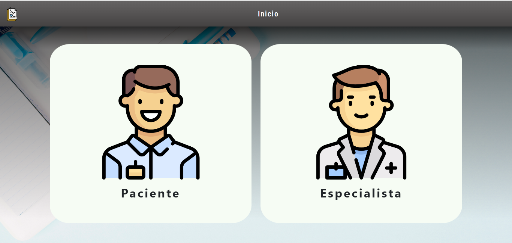
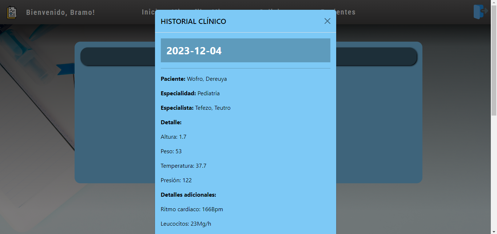

# CLÍNICA ONLINE - Tomás D'Angelo

### La Clínica OnLine, un centro de atención médica especializado, dispone en la actualidad de seis consultorios, dos laboratorios físicos y una sala de espera general. Su horario de atención al público es de lunes a viernes de 8:00 a 19:00, y los sábados de 8:00 a 14:00. Cuenta con profesionales de diversas áreas que utilizan los consultorios según su disponibilidad, atendiendo a pacientes con citas previas para consultas o tratamientos. Los turnos se solicitan a través de la página web, donde se elige al profesional o la especialidad requerida. La duración mínima de una consulta es de 30 minutos, aunque puede variar según la especialidad del profesional. Además, algunos de ellos tienen más de una especialización. Asimismo, la clínica dispone de un área interna dedicada a la organización y gestión administrativa de sus servicios.

  

# INICIO
### Lo primero con lo que nos encontramos es con la página de inicio donde se nos dara la bienvenida y podremos únicamente registrarnos o iniciar sesión.

# REGISTRO

### En esta sección tendremos la opción de registrarnos como "Paciente" o "Especialista".

### Luego, dependiendo de nuestra elección nos aparecera el formulario de registro de "Especialista" o de "Paciente".

# INICIO DE SESIÓN

### En esta sección podremos iniciar sesión con nuestra cuenta previamente creada. Ademas contamos con un apartado de acceso rápido en la esquina inferior izquierda con el cual podremos acceder como "Paciente", "Especialista" o "Administrador".

# VISTAS DE UN PACIENTE
### Al iniciar sesión como un paciente podremos navegar a las siguientes secciones: "MI PERFIL" - "SOLICITAR TURNO" - "MIS TURNOS"

## MI PERFIL
### Dentro de esta sección podremos visualizar todos los datos de nuestro perfil. En el caso de tener un historial clínico podremos visualizarlo tambien desde esta sección y descargarlo en formato PDF. 

## SOLICITAR TURNO
### En esta sección podremos solicitar un turno seleccionando un especialista y luego la especialidad en la cual nos querramos atender.

### Luego se nos desplegara una ventana con todos los días y horarios disponibles del especialista en esa especialidad. Podremos seleccionar el dia y horario en el cual querramos atendernos.

### Al seleccionar el día y horario podremos solicitar el turno.

## MIS TURNOS
### En esta sección podremos visualizar nuestros turnos solicitados en un principio y luego como estos van cambiando su ESTADO dependiendo de si fue "Aceptado", "Rechazado", "Cancelado", "Finalizado".

### Podremos dejar un comentario para calificar luego de que el turno se haya finalizado o un comentario al momento de cancelar de porque lo estamos cancelando al turno.

# VISTAS DE UN ESPECIALISTA
### Al iniciar sesión como un especialista podremos navegar a las siguientes secciones: "MI PERFIL" - "PACIENTES" - "MIS TURNOS"

## MI PERFIL
### Dentro de esta sección podremos visualizar todos los datos de nuestro perfil, asignar los dias que tenemos disponibles para atender cierta especilidad y cambiar la duracion mínima del turno.

## MIS TURNOS
### En esta sección podremos visualizar los turnos solicitados por un paciente con nosotros y podremos realizar las siguientes acciones: "Aceptar el turno" y "Rechazarlo". Una vez aceptado tendremos la oportunidad de finalizarlo o cancelarlo. Al finalizarlo se nos habilitara la opción de "Calificar" en el que podremos dejar un comentario. Una vez hecho el comentario tendremos la opcion de "Cargar la historia clínica" para ingresar todos los datos del paciente.

## PACIENTES
### En esta seccion se mostraran los pacientes que el especialista haya atendido al menos 1 vez. Se podra visualizar su historia clínica, detalles de sus turnos y reseñas del mismo.

# VISTAS DE UN ADMINISTRADOR
### Al iniciar sesión como un paciente podremos navegar a las siguientes secciones: "MI PERFIL" - "SOLICITAR TURNO" - "TURNOS" - "USUARIOS" - "INFORMES"

## MI PERFIL
### Dentro de esta sección podremos visualizar todos los datos de nuestro perfil.

## TURNOS
### Dentro de esta sección se visualizaran los turnos de la clínica donde se podran cancelar los mismos solo si no fue fue aceptado, realizado o rechazado, dejando un comentario del motivo.

## USUARIOS
### En esta seccion se puede visualizar un listado de todos los usuarios registrados en la Clínica Online. Tendremos la opción de registrar un nuevo usuario con el rol de "Paciente", "Especialista" o "Administrador". Tambien contamos con una opcion para descargar el listado de usuarios en formato EXCEL y una opcion con un botón con la foto y nombre del usuario que al presionarlo descarga los datos de que turnos tomo un paciente y con quien en formato EXCEL. Contamos además con la funcionalidad de habilitar o deshabilitar el ingreso de un especialista al sistema y podemos visualizar la historia clínica de los pacientes.

